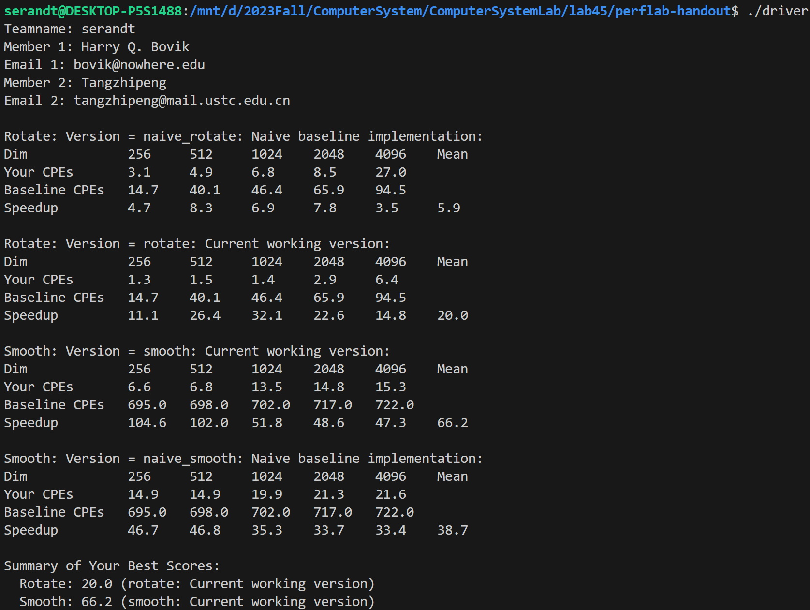
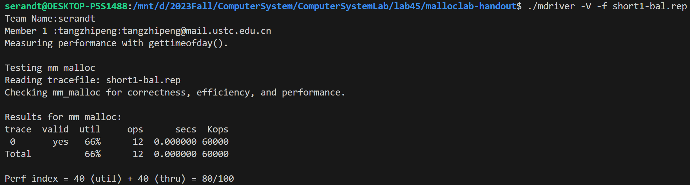

<h1><center>实验四、五报告</center></h1>

<center>BY  唐志鹏  SA23011068</center>

## 实验四

### rotate

- 将矩阵分为 $8 \times 8$ 的块，并在块内部将 `dst` 重复计算的单元提出

  ```c
  void rotate(int dim, pixel *src, pixel *dst) 
  {
      int i, j, t, a, b;
  
      for (j = 0; j < dim; j += 8)
      {
          for (i = 0; i < dim; i += 8)
          {
              for (b = j; b < j + 8; b++)
              {
                  t = (dim - 1 - b) * dim;
                  for (a = i; a < i + 8; a++)
                      dst[t + a] = src[RIDX(a, b, dim)];
              }
          }
      }
  }
  ```

### smooth

- 将所有像素分为三类：

  - $4$ 个顶点：周围四个像素进行平均
  - 边上的点：周围六个像素进行平均
  - 内部点：周围九个像素进行平均

  ```c
  void smooth(int dim, pixel *src, pixel *dst) 
  {
      int i, j, t;
  
      // corner
      int left_top[4] = {0, dim - 2, (dim - 2) * dim, (dim - 2) * dim + (dim - 2)};
      int right_top[4] = {1, dim - 1, (dim - 2) * dim + 1, (dim - 2) * dim + (dim - 1)};
      int left_bottom[4] = {dim, dim + dim - 2, (dim - 1) * dim, (dim - 1) * dim + (dim - 2)};
      int right_bottom[4] = {dim + 1, dim + dim - 1, (dim - 1) * dim + 1, (dim - 1) * dim + (dim - 1)};
      int corners[4] = {0, dim - 1, (dim - 1) * dim, (dim - 1) * dim + (dim - 1)};
      for (i = 0; i < 4; i++)
      {
          dst[corners[i]].blue = (src[left_top[i]].blue + src[right_top[i]].blue + src[left_bottom[i]].blue + src[right_bottom[i]].blue) / 4;
          dst[corners[i]].green = (src[left_top[i]].green + src[right_top[i]].green + src[left_bottom[i]].green + src[right_bottom[i]].green) / 4;
          dst[corners[i]].red = (src[left_top[i]].red + src[right_top[i]].red + src[left_bottom[i]].red + src[right_bottom[i]].red) / 4;
      }
  
      // border
      i = 0; // top
      for (j = 1; j <= dim - 2; j++)
      {
          dst[j].blue = (src[RIDX(i, j - 1, dim)].blue + src[RIDX(i, j, dim)].blue + src[RIDX(i, j + 1, dim)].blue + src[RIDX(i + 1, j - 1, dim)].blue + src[RIDX(i + 1, j, dim)].blue + src[RIDX(i + 1, j + 1, dim)].blue) / 6;
          dst[j].green = (src[RIDX(i, j - 1, dim)].green + src[RIDX(i, j, dim)].green + src[RIDX(i, j + 1, dim)].green + src[RIDX(i + 1, j - 1, dim)].green + src[RIDX(i + 1, j, dim)].green + src[RIDX(i + 1, j + 1, dim)].green) / 6;
          dst[j].red = (src[RIDX(i, j - 1, dim)].red + src[RIDX(i, j, dim)].red + src[RIDX(i, j + 1, dim)].red + src[RIDX(i + 1, j - 1, dim)].red + src[RIDX(i + 1, j, dim)].red + src[RIDX(i + 1, j + 1, dim)].red) / 6;
      }
      i = dim - 1; // bottom
      for (j = 1; j <= dim - 2; j++)
      {
          dst[RIDX(i, j, dim)].blue = (src[RIDX(i - 1, j - 1, dim)].blue + src[RIDX(i - 1, j, dim)].blue + src[RIDX(i - 1, j + 1, dim)].blue + src[RIDX(i, j - 1, dim)].blue + src[RIDX(i, j, dim)].blue + src[RIDX(i, j + 1, dim)].blue) / 6;
          dst[RIDX(i, j, dim)].green = (src[RIDX(i - 1, j - 1, dim)].green + src[RIDX(i - 1, j, dim)].green + src[RIDX(i - 1, j + 1, dim)].green + src[RIDX(i, j - 1, dim)].green + src[RIDX(i, j, dim)].green + src[RIDX(i, j + 1, dim)].green) / 6;
          dst[RIDX(i, j, dim)].red = (src[RIDX(i - 1, j - 1, dim)].red + src[RIDX(i - 1, j, dim)].red + src[RIDX(i - 1, j + 1, dim)].red + src[RIDX(i, j - 1, dim)].red + src[RIDX(i, j, dim)].red + src[RIDX(i, j + 1, dim)].red) / 6;
      }
      j = 0; // left
      for (i = 1; i <= dim - 2; i++)
      {
          dst[RIDX(i, j, dim)].blue = (src[RIDX(i - 1, j, dim)].blue + src[RIDX(i - 1, j + 1, dim)].blue + src[RIDX(i, j, dim)].blue + src[RIDX(i, j + 1, dim)].blue + src[RIDX(i + 1, j, dim)].blue + src[RIDX(i + 1, j + 1, dim)].blue) / 6;
          dst[RIDX(i, j, dim)].green = (src[RIDX(i - 1, j, dim)].green + src[RIDX(i - 1, j + 1, dim)].green + src[RIDX(i, j, dim)].green + src[RIDX(i, j + 1, dim)].green + src[RIDX(i + 1, j, dim)].green + src[RIDX(i + 1, j + 1, dim)].green) / 6;
          dst[RIDX(i, j, dim)].red = (src[RIDX(i - 1, j, dim)].red + src[RIDX(i - 1, j + 1, dim)].red + src[RIDX(i, j, dim)].red + src[RIDX(i, j + 1, dim)].red + src[RIDX(i + 1, j, dim)].red + src[RIDX(i + 1, j + 1, dim)].red) / 6;
      }
      j = dim - 1; // right
      for (i = 1; i <= dim - 2; i++)
      {
          dst[RIDX(i, j, dim)].blue = (src[RIDX(i - 1, j - 1, dim)].blue + src[RIDX(i - 1, j, dim)].blue + src[RIDX(i, j - 1, dim)].blue + src[RIDX(i, j, dim)].blue + src[RIDX(i + 1, j - 1, dim)].blue + src[RIDX(i + 1, j, dim)].blue) / 6;
          dst[RIDX(i, j, dim)].green = (src[RIDX(i - 1, j - 1, dim)].green + src[RIDX(i - 1, j, dim)].green + src[RIDX(i, j - 1, dim)].green + src[RIDX(i, j, dim)].green + src[RIDX(i + 1, j - 1, dim)].green + src[RIDX(i + 1, j, dim)].green) / 6;
          dst[RIDX(i, j, dim)].red = (src[RIDX(i - 1, j - 1, dim)].red + src[RIDX(i - 1, j, dim)].red + src[RIDX(i, j - 1, dim)].red + src[RIDX(i, j, dim)].red + src[RIDX(i + 1, j - 1, dim)].red + src[RIDX(i + 1, j, dim)].red) / 6;
      }
  
      // others
      for (i = 1; i <= dim - 2; i++)
      {
          t = i * dim;
          for (j = 1; j <= dim - 2; j++)
          {
              dst[t + j].blue = (src[t - dim + j - 1].blue + src[t - dim + j].blue + src[t - dim + j + 1].blue + src[t + j - 1].blue + src[t + j].blue + src[t + j + 1].blue + src[t + dim + j - 1].blue + src[t + dim + j].blue + src[t + dim + j + 1].blue) / 9;
              dst[t + j].green = (src[t - dim + j - 1].green + src[t - dim + j].green + src[t - dim + j + 1].green + src[t + j - 1].green + src[t + j].green + src[t + j + 1].green + src[t + dim + j - 1].green + src[t + dim + j].green + src[t + dim + j + 1].green) / 9;
              dst[t + j].red = (src[t - dim + j - 1].red + src[t - dim + j].red + src[t - dim + j + 1].red + src[t + j - 1].red + src[t + j].red + src[t + j + 1].red + src[t + dim + j - 1].red + src[t + dim + j].red + src[t + dim + j + 1].red) / 9;
          }
      }
  }
  ```

### 实验结果



## 实验五

用链表寻址，定义链表的数据结构由内存块表示。在每个块头 8 个字节、尾 8 个字节存储内存块长度信息。由于要求节点按 8 位对齐，则，长度的二进制末 3 位为 0。因此用末位标识这个块是否存储信息，1 表示已存储，0 表示空。

宏定义如下。其中 `GET_SIZE` 返回指针 `p` 指向的的内存块的大小，`GET_ALLOC` 返回指针 `p` 指向的内存块的存储信息。`HDRP` 返回指针 `bp` 所在的内存块的头 8 字节的首地址，`FTRP` 返回指针 `bp` 所在的内存块的尾 8 字节的首地址。`NEXT_BLKP` 返回在链表中指针 `bp` 的后继的地址，`PREV_BLKP` 返回在链表中指针 `bp` 的前驱的地址。

```c
#define SIZE_T_SIZE (ALIGN(sizeof(size_t)))

#define WSIZE 4
#define DSIZE 8

#define MAX(x, y) ((x) > (y) ? (x) : (y))
#define PACK(size, alloc) ((size) | (alloc))

#define GET(p) (*(unsigned int *)(p))
#define PUT(p, val)(*(unsigned int *)(p) = (val))

#define GET_SIZE(p) (GET(p) & ~0x7)
#define GET_ALLOC(p) (GET(p) & 0x1)

#define HDRP(bp) ((char*)(bp) - WSIZE)
#define FTRP(bp) ((char*)(bp) + GET_SIZE(HDRP(bp)) - DSIZE)

#define NEXT_BLKP(bp) ((char*)(bp) + GET_SIZE(HDRP(bp)))
#define PREV_BLKP(bp) ((char*)(bp) - GET_SIZE((char*)(bp) - DSIZE))
static char* heap_listp, *pre_listp;
```

### mm_init

`mm_init` 的主要作用为初始化内存，设置链表的头字节为数据长度为 0，内存长度为 16 字节的内存块，并且设置该块已存储。同时用 `extend_heap` 函数扩展堆 4096 字节，设置链表尾节点。

```c
int mm_init(void)
{
    if ((heap_listp = mem_sbrk(4*WSIZE))==(void*)-1) 
        return -1;
    PUT(heap_listp, 0); 
    PUT(heap_listp + (1 * WSIZE), PACK(DSIZE, 1)); 
    PUT(heap_listp + (2 * WSIZE),PACK(DSIZE,1));

    PUT(heap_listp +(3 * WSIZE),PACK(0,1)); 
    heap_listp += (2 * WSIZE);
    pre_listp = heap_listp;

    if (extend_heap((size_t)1024) == NULL) 
        return -1;
    return 0;
}
```

`extend_heap` 函数扩展堆，并将扩展的内存初始化为一个空内存块，并设置该内存块的后继为数据长度为 0，内存长度为 16 字节的内存块，并且设置该块已存储。最后还需要调用 `coalesce` 函数合并空内存块。

```c
static void* extend_heap(size_t words)
{
    char* bp;
    size_t size;
    size = (words % 2) ? (words + 1) * WSIZE : words * WSIZE;
    if ((long)(bp = mem_sbrk(size)) == -1) return NULL;

    /* Initalize */
    PUT(HDRP(bp), PACK(size, 0));
    PUT(FTRP(bp), PACK(size, 0));
    PUT(HDRP(NEXT_BLKP(bp)), PACK(0,1));

    return coalesce(bp);
}
```

`coalesce` 函数作用为合并指针 `bp` 指向的空内存块与其前驱内存块和后继内存块。

```c
static void* coalesce(void *bp)
{
    size_t prev_alloc = GET_ALLOC(FTRP(PREV_BLKP(bp)));
    size_t next_alloc = GET_ALLOC(HDRP(NEXT_BLKP(bp)));
    size_t size = GET_SIZE(HDRP(bp));

    if (prev_alloc && next_alloc)
        return bp;
    else if (prev_alloc && !next_alloc)
    {
        size += GET_SIZE(HDRP(NEXT_BLKP(bp)));
        PUT(HDRP(bp), PACK(size, 0));
        PUT(FTRP(bp), PACK(size, 0));
    }
    else if (!prev_alloc && next_alloc)
    {
        size += GET_SIZE(HDRP(PREV_BLKP(bp)));
        PUT(FTRP(bp), PACK(size, 0));
        PUT(HDRP(PREV_BLKP(bp)), PACK(size, 0));
        bp = PREV_BLKP(bp);
    }
    else
    {
        size += GET_SIZE(HDRP(PREV_BLKP(bp))) + GET_SIZE(FTRP(NEXT_BLKP(bp)));
        PUT(HDRP(PREV_BLKP(bp)), PACK(size, 0));
        PUT(FTRP(NEXT_BLKP(bp)), PACK(size, 0));
        bp = PREV_BLKP(bp);
    }

    return bp;
}
```

### mm_malloc

`mm_malloc` 函数首先将需求内存大小调整为 8 字节倍数，然后调用 `find_fit` 寻找合适的空内存块。如果存在合适的空内存块，调用 `place` 函数将空内存块划分为已存储内存和剩余空内存；如果不存在合适的空内存块，调用 `extend_heap` 函数继续扩展堆内存，扩展后直接调用 `place` 函数对新内存进行划分。

```c
void *mm_malloc(size_t size)
{
    size_t asize; // adjusted block size
    size_t extendsize; // amount to extend heap if no fit
    char* bp;

    if (size == 0)
        return NULL;

    // adjusted block size to include overhead and alignment reqs
    if (size <= DSIZE)
        asize = 2*DSIZE;
    else
        asize = DSIZE * ((size + (DSIZE) + (DSIZE - 1)) / DSIZE);

    if ((bp = find_fit(asize)) != NULL)
    {
        place(bp, asize);
        return bp;
    }

    // no fit found, get more memory and place the block
    extendsize = MAX(asize, 4096);
    if ((bp = extend_heap(extendsize / WSIZE)) == NULL)
        return NULL;
    place(bp, asize);
    return bp;
}
```

`find_fit` 函数寻找合适的空内存块存储。具体算法为：从上次寻找的链表节点开始顺序搜索空内存块，如果到链表尾节点后没有合适大小的块，则从头节点开始寻找。

```c
static void* find_fit(size_t asize)
{
    for (char* bp = heap_listp; GET_SIZE(HDRP(bp)) > 0; bp = NEXT_BLKP(bp))
    {
        if (!GET_ALLOC(HDRP(bp)) && GET_SIZE(HDRP(bp)) >= asize)
        {
            return bp;
        }
    }
    return NULL;
}
```

`place` 函数划分空内存块。如果剩余的空内存块不足 16 字节，也就不足以放下最小数据单元，就直接跳过，否则就设置为空内存块。

```c
static void place(void* bp, size_t asize)
{
    size_t size = GET_SIZE(HDRP(bp));
    PUT(HDRP(bp), PACK(size, 1));
    PUT(FTRP(bp), PACK(size, 1));

        if ((size - asize) >= 16)
    {
        PUT(HDRP(bp), PACK(asize, 1));
        PUT(FTRP(bp), PACK(asize, 1));
        bp = NEXT_BLKP(bp);
        PUT(HDRP(bp), PACK(size-asize, 0));
        PUT(FTRP(bp), PACK(size-asize, 0));
    }
}
```

### mm_free

`mm_free` 直接将指示位设置为 0 后调用 `coalesec` 函数进行空内存块合并。

```c
void mm_free(void *ptr)
{
    size_t size = GET_SIZE(HDRP(ptr));

    PUT(HDRP(ptr), PACK(size, 0));
    PUT(FTRP(ptr), PACK(size, 0));
    coalesce(ptr);
}
```

### 实验结果



